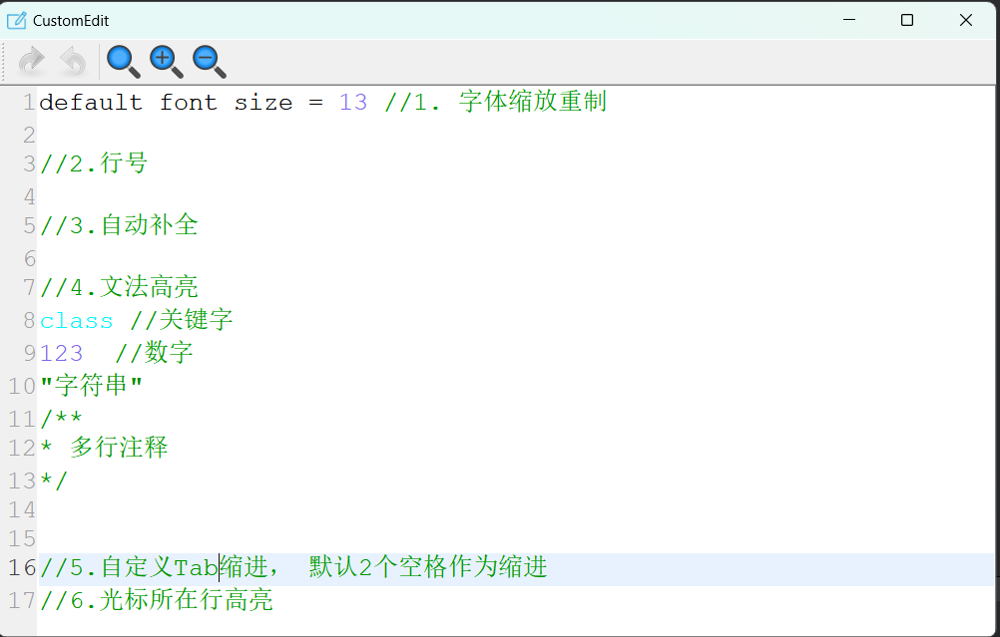

<p align = "center" style="font-size:40px; "> CustomEdit - 自定义文本编辑器 </p>



# 背景

> 原生 `QPlainTextEdit`或者`QTextEdit`有一些功能没有，对于一些功能想要实现自定义，

---

# 功能

## 1.QPlainTextEdit

- 选择`QPlainTextEdit`作为基类是因为`QPlainTextEdit`以行更新滚动，而不是像素，处理大批量文本有一定的优势，后续可能会需要编辑器中插入图片

  ```c++
  class PlainTextEdit : public QPlainTextEdit
  ```

---

## 2. 字体放大缩小重置

- 因为需要字体大小可控，所以没有用`QPlainTextEdit` 提供的`zoomIn`等方法，而是自己在 继承类提供了字体变化的方法

  ```c++
  void resetZoom();
  void zoomIn();
  void zoomOut();
  ```

- 滚动鼠标

  ```c++
  virtual void wheelEvent(QWheelEvent* event) override; //plainTextEdit 鼠标滚动事件
  ```

- toolBar + 快键键

  ```c++
  QAction*       mpZoomInAction;
  QAction*       mpZoomOutAction;  //MainWindow 的两个action响应
  ```

---

## 3. 行号

- 主要思路

  

  

  > ​		两个窗口叠加实现，设置文本编辑器的左间距使它恰好等于行号窗口的宽度，行号窗口以文本编辑器作为父类，依据文本编辑器的`QDocumentText`设定位置和高度，宽度由行号的位数绝定，重绘字体以QDocument为准

- 行号窗体类

  ```c++
  class LineNumberArea
  protected:
      virtual void paintEvent(QPaintEvent* event) override;//重写 paintEvent 绘制窗体与行号 
  ```

- 窗体更新信号槽

  ```c++
      connect(this, SIGNAL(blockCountChanged(int)), this, SLOT(updateLineNumberAreaWidth(int)));
      connect(this, SIGNAL(updateRequest(QRect, int)), this, SLOT(updateLineNumberArea(QRect, int)));
  ```

  ---

## 4. 自动补全

自动补全主要涉及`QComplete`、`QStandardItemModel`、`QSortFilterProxyModel`、`CompleteItem`四个类

| 类                    | 概述           |
| --------------------- | -------------- |
| QStandardItemModel    | 数据模型       |
| QSortFilterProxyModel | 数据模型代理类 |
| QComplete             | 自动补全类     |
| CompleteItem          | 实际数据       |

- 初始化

  1. 初始化 model

     ```c++
      QStandardItem* pStandardItem = new QStandardItem(types[k]);
      pStandardItem->setData(QVariant::fromValue(CompleterItem(types[k], types[k], "")), Qt::UserRole);
      mpStandardItemModel->appendRow(pStandardItem);
     ```

  2. 初始化数据模型代理类

- 显示自动补全窗口

  ```c++
      virtual void PlainTextEdit::keyPressEvent(QKeyEvent* pEvent) override; 
  ```

  > 在`keyPressEvent`中根据按键实现补全窗口

- 信号槽

  ```c++
  connect(mpCompleter, SIGNAL(highlighted(QModelIndex)), this, SLOT(showCompletionItemToolTip(QModelIndex)));
  connect(mpCompleter, SIGNAL(activated(QModelIndex)), this, SLOT(insertCompletionItem(QModelIndex)));
  ```

  ---

## 5.语法高亮

`class TextHighlighter `继承`QSyntaxHighlighter`接口实现`highlightBlock()`接口

- 初始化着色规则

  ```c++
  void TextHighlighter::initializeSettings()
  ```

- 高亮文本块

  ```c++
  void TextHighlighter::highlightBlock(const QString& text) //每输入一个字符执行一次，自动执行
  ```

---

## 6.光标所在行高亮

- 信号槽

  ```c++
    connect(this, SIGNAL(cursorPositionChanged()), this, SLOT(updateHighlights()));
  ```

## 7.自定义Tab缩进

- 设置tab应该替代的空格数

  ```c++
      if (pEvent->key() == Qt::Key_Tab || pEvent->key() == Qt::Key_Backtab)
      {
          // 缩进或者
          indentOrUnindent(pEvent->key() == Qt::Key_Tab);
          return;
      }
  ```

---

# 待实现的功能

1. 代码折叠
2. undo redo action
3. 调试断点
4. 按住 ctrl +  光标，文本跳转事件
5. 文本补全辅助窗口
6. 文本格式化
